<p align="center">
  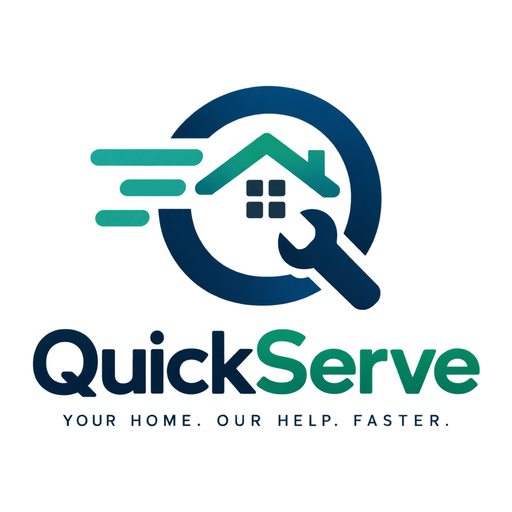
</p>

<h1 align="center">QuickServe</h1>
<p align="center"><em>Your Home. Our Help. Faster.</em></p>

<p align="center">
  A multi-role, database-secured service-request platform built for the SWASIQ Technology
  internship technical assignment — Customer mobile app, Agent mobile app, and Admin web
  portal, all running on a single Supabase backend.
</p>

---

## Table of Contents

1. [Overview](#overview)
2. [Screenshots](#screenshots)
3. [Why This Architecture](#why-this-architecture)
4. [Tech Stack](#tech-stack)
5. [System Architecture](#system-architecture)
6. [Repository Structure](#repository-structure)
7. [Features by Role](#features-by-role)
8. [Request Lifecycle](#request-lifecycle)
9. [Getting Started](#getting-started)
10. [Environment Variables](#environment-variables)
11. [Documentation Index](#documentation-index)
12. [Known Limitations](#known-limitations)
13. [Roadmap](#roadmap)
14. [Credits](#credits)

---

## Overview

QuickServe is a service-request management platform with three connected applications sharing
one backend:

| App | Platform | Used by |
|---|---|---|
| **Customer App** | Flutter (Android) | Customers requesting home services |
| **Agent App** | Flutter (Android) | Field agents fulfilling assigned requests |
| **Admin Portal** | Next.js (Web, deployed on Vercel) | Administrators managing the whole operation |

A customer creates a request for a service (AC repair, plumbing, electrical, cleaning). An
admin reviews it, checks which agents are qualified for that service, and assigns one. The
agent works the request through to completion. Every status change, every important record
change, and every push notification is driven from the database layer — not the UI — so the
system stays consistent and auditable no matter which app touched it.

The project deliberately treats **the database as the security boundary**, not the app code.
See [`docs/SECURITY.md`](docs/SECURITY.md) for the full reasoning.

---

## Screenshots

> Drop your screenshots into the matching folder under `docs/screenshots/` using the filenames
> below, and every image in this README will render automatically — no other edits needed.

### Customer App

<table>
<tr>
<td align="center">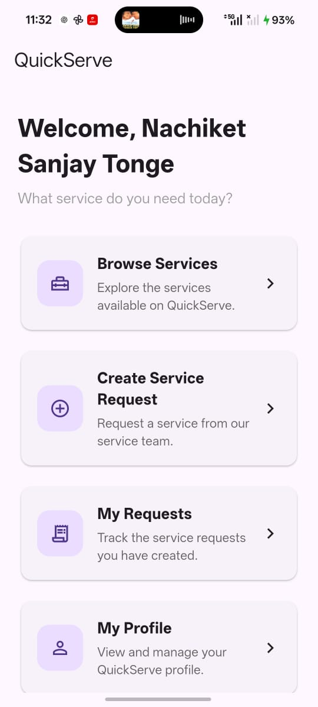<br/><sub>Home</sub></td>
<td align="center">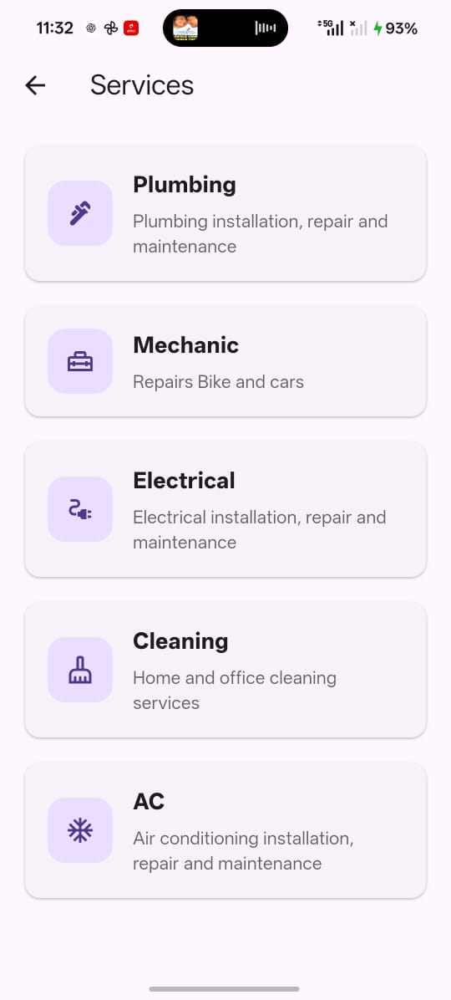<br/><sub>Services</sub></td>
<td align="center">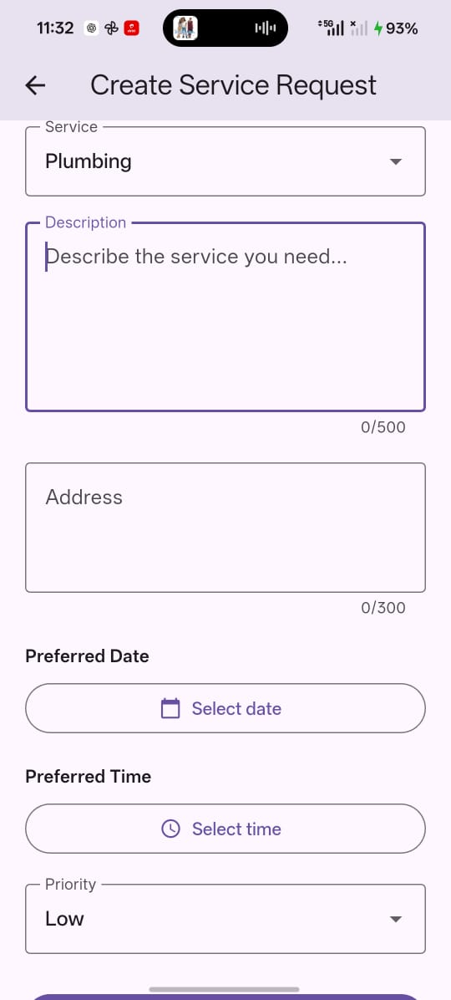<br/><sub>Create Request</sub></td>
</tr>
<tr>
<td align="center">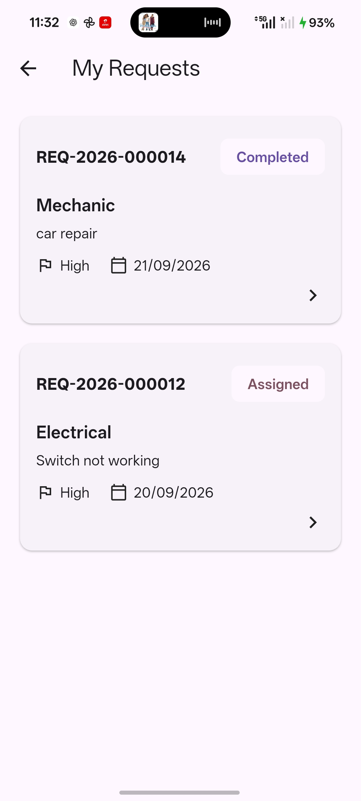<br/><sub>My Requests</sub></td>
<td align="center">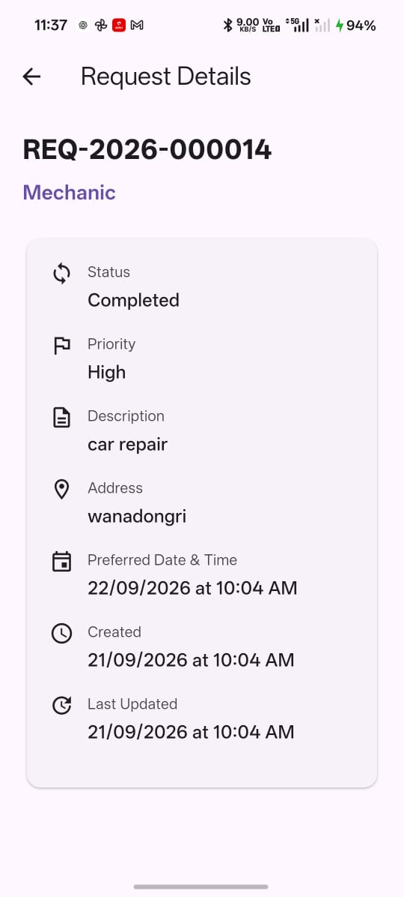<br/><sub>Request Details</sub></td>
<td align="center">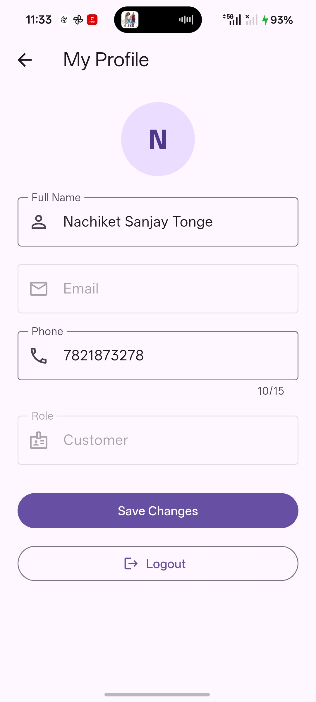<br/><sub>Profile</sub></td>
</tr>
</table>

### Agent App

<table>
<tr>
<td align="center">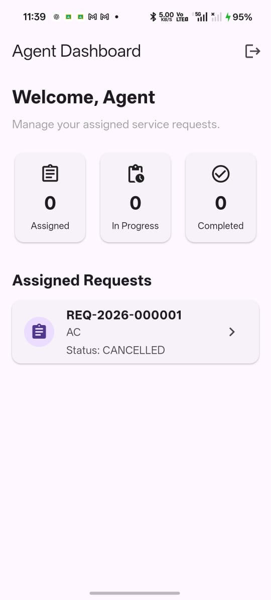<br/><sub>Agent Dashboard</sub></td>
<td align="center">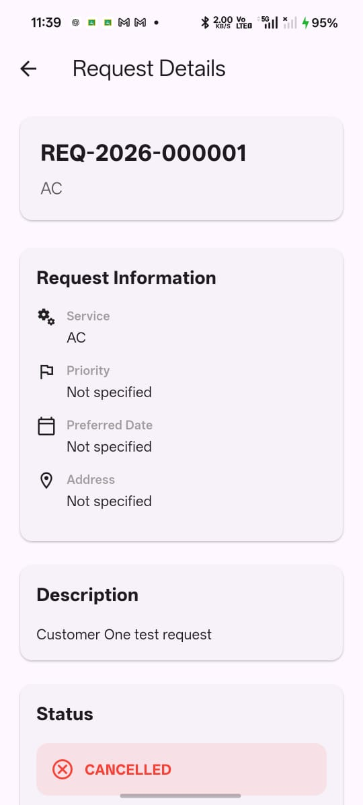<br/><sub>Assigned Requests</sub></td>
<td align="center"><br/><sub>Request Details</sub></td>
</tr>
<tr>
<td align="center">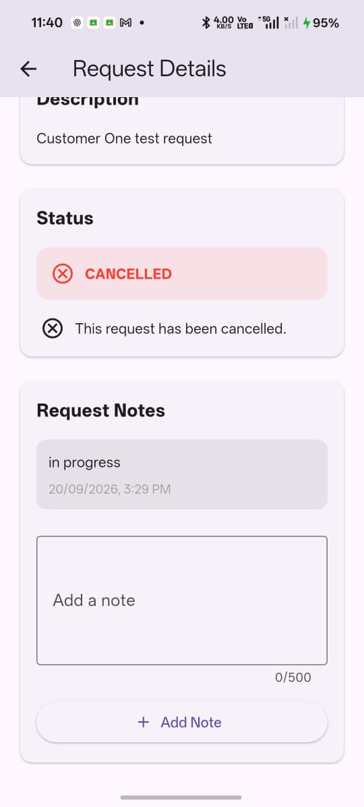<br/><sub>Start / Complete Work</sub></td>

</tr>
</table>

### Admin Web Portal

<table>
<tr>
<td align="center">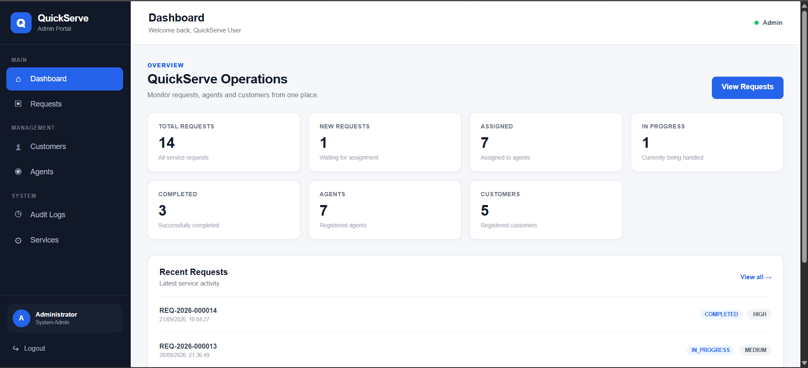<br/><sub>Dashboard</sub></td>
<td align="center">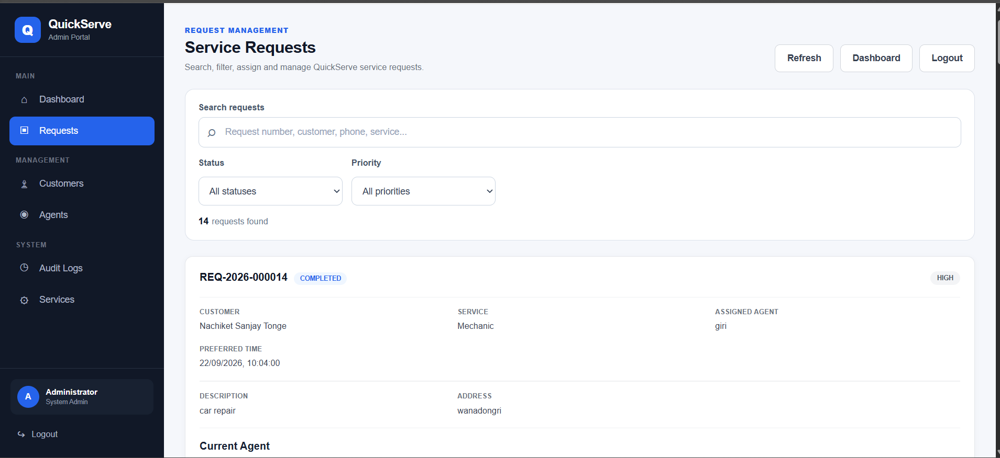<br/><sub>Request Management</sub></td>
</tr>
<tr>

<td align="center">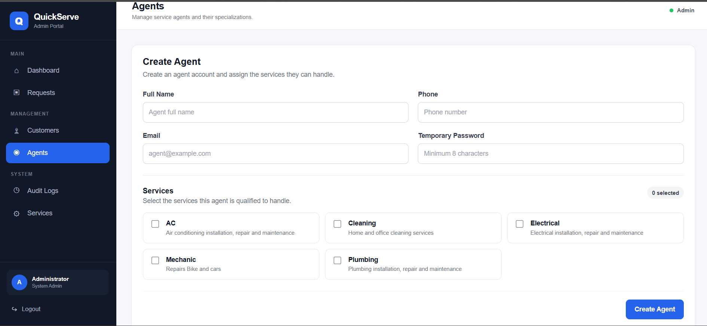<br/><sub>Create Agent</sub></td>
</tr>
<tr>
<td align="center">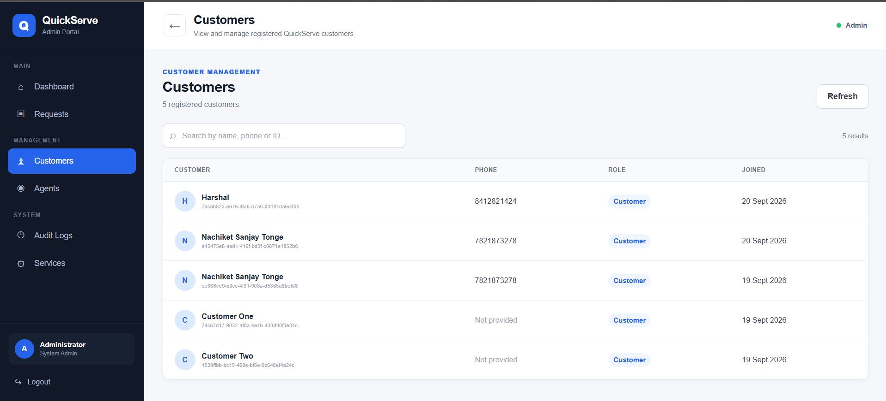<br/><sub>Customer Management</sub></td>
<td align="center">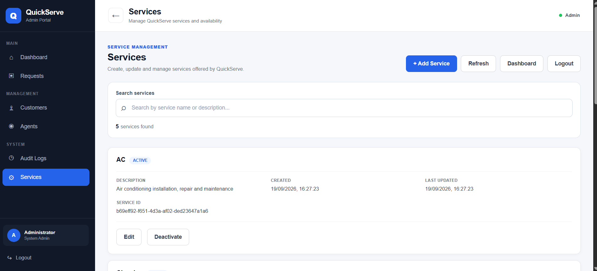<br/><sub>Service Management</sub></td>
</tr>
<tr>
<td align="center">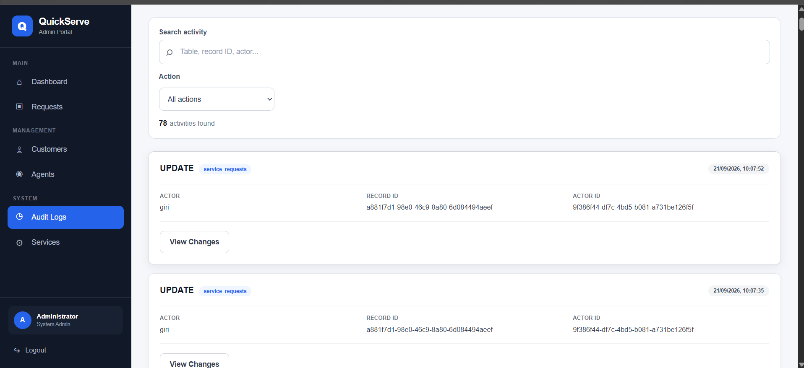<br/><sub>Audit Logs</sub></td>
<td align="center">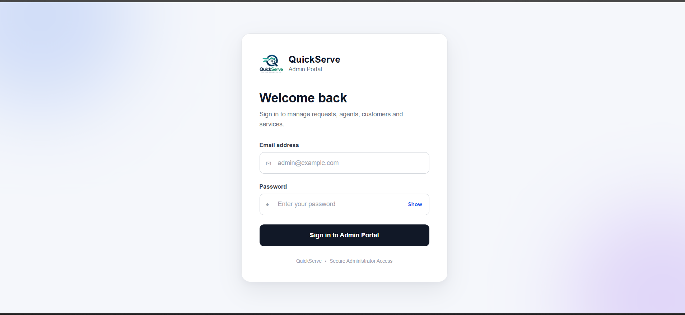<br/><sub>Admin Login</sub></td>
</tr>
</table>

---

## Why This Architecture

The assignment is graded on judgment, not feature count — specifically on security enforced at
the data layer, a justifiable data model, meaningful audit/logging, and the ability to explain
every decision. That shaped three deliberate choices:

- **Supabase over a hand-built backend.** QuickServe's data is strongly relational (a request
  belongs to a customer, is optionally assigned to an agent, references a service, and has a
  one-to-many history). Supabase gives managed PostgreSQL, Auth, and Row Level Security as one
  connected system, so no custom backend had to be written or deployed.
- **RLS-first, not RLS-retrofitted.** Row Level Security policies were written on Day 1,
  alongside the schema — before any UI existed — so authorization is structural, not patched on
  afterward.
- **The database enforces the rules the UI merely displays.** Status transitions, ownership
  fields, audit records, and status history are all controlled by PostgreSQL functions and
  triggers, so a modified or bypassed client still cannot violate the business rules.

---

## Tech Stack

| Layer | Technology |
|---|---|
| Customer & Agent Apps | Flutter 3.47.5, Dart 3.13.4 |
| Mobile navigation | go_router |
| Mobile state management | flutter_riverpod |
| Mobile config | flutter_dotenv (Supabase URL/key via `--dart-define`, never committed) |
| Mobile ↔ backend | supabase_flutter |
| Push notifications | firebase_core, firebase_messaging (Firebase Cloud Messaging) |
| App branding | flutter_launcher_icons |
| Admin Web Portal | Next.js (App Router), React, TypeScript |
| Web styling | Tailwind CSS |
| Web ↔ backend | @supabase/supabase-js |
| Backend platform | Supabase |
| Database | PostgreSQL |
| Authentication | Supabase Auth |
| Authorization | PostgreSQL Row Level Security (RLS) + database functions |
| Business rules / automation | PostgreSQL functions & triggers |
| Serverless push logic | Supabase Edge Functions (Deno/TypeScript) |
| Web deployment | Vercel |
| Backend & Edge Function deployment | Supabase |
| Mobile distribution | Android release APK |

There is no separate application backend (e.g. Spring Boot) in QuickServe — Supabase **is** the
backend. Firebase is used exclusively for push delivery.

---

## System Architecture

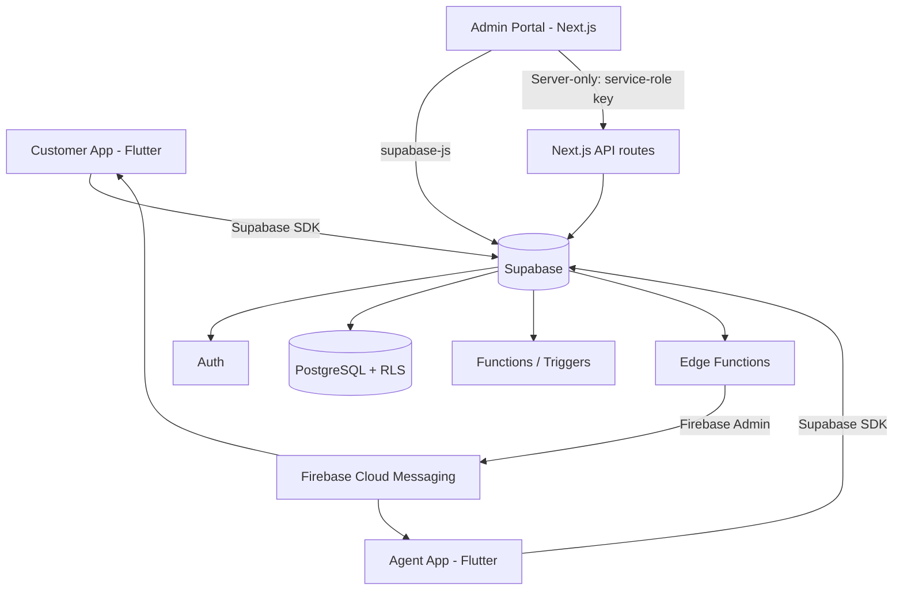

**Security principle:** none of the three client apps is a trusted security boundary. Every one
of them calls Supabase, but PostgreSQL RLS — not the Flutter widget tree and not a React
component — decides which rows an authenticated identity may read or write. See
[`docs/SECURITY.md`](docs/SECURITY.md).

---

## Repository Structure

```
quickserve/
├── mobile/                        # Flutter — Customer & Agent apps (feature-first)
│   ├── lib/
│   │   ├── core/                  # supabase client, router, theme, config
│   │   └── features/
│   │       ├── auth/
│   │       ├── services/
│   │       ├── requests/
│   │       ├── profile/
│   │       └── agent/             # AgentHomeScreen, AgentRequestsScreen, etc.
│   ├── android/ ios/
│   └── pubspec.yaml
│
├── web/                            # Next.js Admin Portal
│   ├── app/
│   │   ├── dashboard/
│   │   ├── requests/
│   │   ├── customers/
│   │   ├── agents/
│   │   ├── services/
│   │   ├── audit-logs/
│   │   ├── login/
│   │   └── api/admin/agents/       # server-side agent creation (service-role)
│   ├── components/
│   └── lib/
│
├── supabase/
│   └── functions/
│       └── send-push-notification/ # Edge Function — FCM dispatch
│
├── docs/
│   ├── DATABASE.md
│   ├── ARCHITECTURE.md
│   ├── SECURITY.md
│   ├── BUILD_LOG.md
│   └── screenshots/
│
└── .github/
```

---

## Features by Role

### Customer

- Register / login / logout, with session persistence
- Browse active services
- Create a service request (service, description, date/time, address, priority)
- View "My Requests" (scoped automatically by RLS)
- View request details and status timeline
- Edit profile (name, phone — email and role are read-only)
- Password reset (email-based)

### Agent

- Login (agent accounts are admin-provisioned only — no self-registration into this role)
- Agent dashboard with assigned / in-progress / completed counts
- View assigned requests, filtered to that agent by RLS
- Start work (`ASSIGNED → IN_PROGRESS`) and complete work (`IN_PROGRESS → COMPLETED`)
- Add internal notes to a request
- Receive a push notification the moment a request is assigned

### Admin

- Login restricted to `role = admin` (server-side check, not a hidden button)
- Dashboard with real, live counts by request status, plus agent/customer totals
- Customer directory with search (name / phone / ID)
- Agent directory with search, and **Create Agent** (name, email, password, service
  specializations — agents cannot self-register into this role)
- Service catalog management (create, edit, activate/deactivate — no hard delete, to preserve
  request history)
- Request management: search, filter by status/priority, view details, assign a qualified
  agent, update status
- Audit log viewer with filters (table, actor, action) and expandable before/after JSON

---

## Request Lifecycle

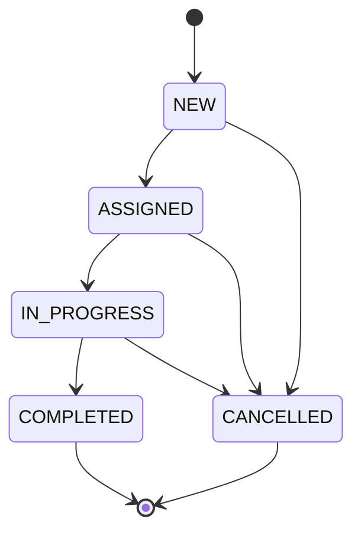

Every transition is validated inside PostgreSQL (`validate_request_status_transition()`), so an
invalid jump — say, `NEW → COMPLETED` — is rejected by the database even if some client
attempted it directly. Every transition also automatically writes a row to
`request_status_history` and triggers the relevant push notification. Full detail in
[`docs/DATABASE.md`](docs/DATABASE.md).

---

## Getting Started

### Prerequisites

- Flutter 3.47.5 / Dart 3.13.4, with an Android emulator or device
- Node.js (for the Next.js admin portal)
- A Supabase project (PostgreSQL + Auth + Edge Functions)
- A Firebase project configured for FCM (Android)
- Supabase CLI (`npm install supabase --save-dev`)

### 1. Backend (Supabase)

```bash
npx supabase login
npx supabase link --project-ref <your-project-ref>
```

Run the schema and policies described in [`docs/DATABASE.md`](docs/DATABASE.md) via the SQL
editor or migrations, then deploy the Edge Function:

```bash
npx supabase functions new send-push-notification   # already present under supabase/functions
npx supabase functions deploy send-push-notification
npx supabase secrets set FIREBASE_SERVICE_ACCOUNT_B64=<base64-encoded-service-account-json>
```

### 2. Mobile apps (Customer & Agent)

```bash
cd mobile
flutter pub get
flutter run -d <device-id> \
  --dart-define=SUPABASE_URL=<your-supabase-url> \
  --dart-define=SUPABASE_PUBLISHABLE_KEY=<your-anon-key>
```

Release build:

```bash
flutter clean && flutter pub get
flutter build apk --release
```

### 3. Admin web portal

```bash
cd web
npm install
cp .env.example .env.local   # fill in the values below
npm run dev
```

Deployed production build: Vercel (auto-deploy from `main`, or `vercel --prod`).

---

## Environment Variables

| Variable | Where | Visibility |
|---|---|---|
| `SUPABASE_URL` | Mobile (`--dart-define`) | Public/client-safe |
| `SUPABASE_PUBLISHABLE_KEY` | Mobile (`--dart-define`) | Public/client-safe |
| `NEXT_PUBLIC_SUPABASE_URL` | Web (`.env.local`) | Public/client-safe |
| `NEXT_PUBLIC_SUPABASE_PUBLISHABLE_KEY` | Web (`.env.local`) | Public/client-safe |
| `SUPABASE_SERVICE_ROLE_KEY` | Web server only (`/api/admin/agents`) | **Server-only — never in Flutter or the browser bundle** |
| `FIREBASE_SERVICE_ACCOUNT_B64` | Supabase secret (Edge Function) | **Server-only** — base64-encoded Firebase service-account JSON |

See [`docs/SECURITY.md`](docs/SECURITY.md#secrets-architecture) for why each of these is scoped
the way it is.

---

## Documentation Index

| Document | Covers |
|---|---|
| [`docs/DATABASE.md`](docs/DATABASE.md) | Full schema, ER diagram, indexes, functions/triggers, RLS policies, request numbering |
| [`docs/ARCHITECTURE.md`](docs/ARCHITECTURE.md) | System design, data flow, push-notification pipeline, agent-provisioning flow |
| [`docs/SECURITY.md`](docs/SECURITY.md) | Authn vs authz, RLS policy reference, secrets architecture, what was tested |
| `docs/BUILD_LOG.md` | Day-by-day decisions and problems solved (interview prep material) |

---

## Known Limitations

These are documented deliberately rather than hidden — they reflect real product decisions and
one open config issue:

- **Password reset email delivery** is currently limited by Supabase's email/rate-limit
  configuration in this environment. The reset flow itself is implemented and will work once
  email sending is enabled with a verified sender.
- **Request notes visibility** is currently agent-only by design: customers cannot see agent
  notes, and the admin dashboard does not surface them. Notes are treated as an internal agent
  reference, not customer-facing communication.
- **Device token ownership**: the same FCM token was observed associated with more than one
  user during testing (e.g. re-login on the same device). The current constraint prevents
  duplicate rows for a single user but does not yet enforce single-user ownership per token —
  flagged as a future cleanup item, not a blocker for the implemented notification flow.

## Roadmap

- Enforce one active owner per FCM device token
- Automated integration tests for cross-role RLS isolation (in addition to the manual role
  impersonation tests already performed)
- Pagination / advanced filtering on the admin requests table
- Surface request notes to admins in a read-only view

## Credits

Built by **Nachiket Tonge** as the technical assignment for the **SWASIQ Technology**
internship.

- Repository: [`github.com/nachiket-tonge/quickserve`](https://github.com/nachiket-tonge/quickserve)
- Backend: [Supabase](https://supabase.com)
- Push delivery: [Firebase Cloud Messaging](https://firebase.google.com/products/cloud-messaging)
