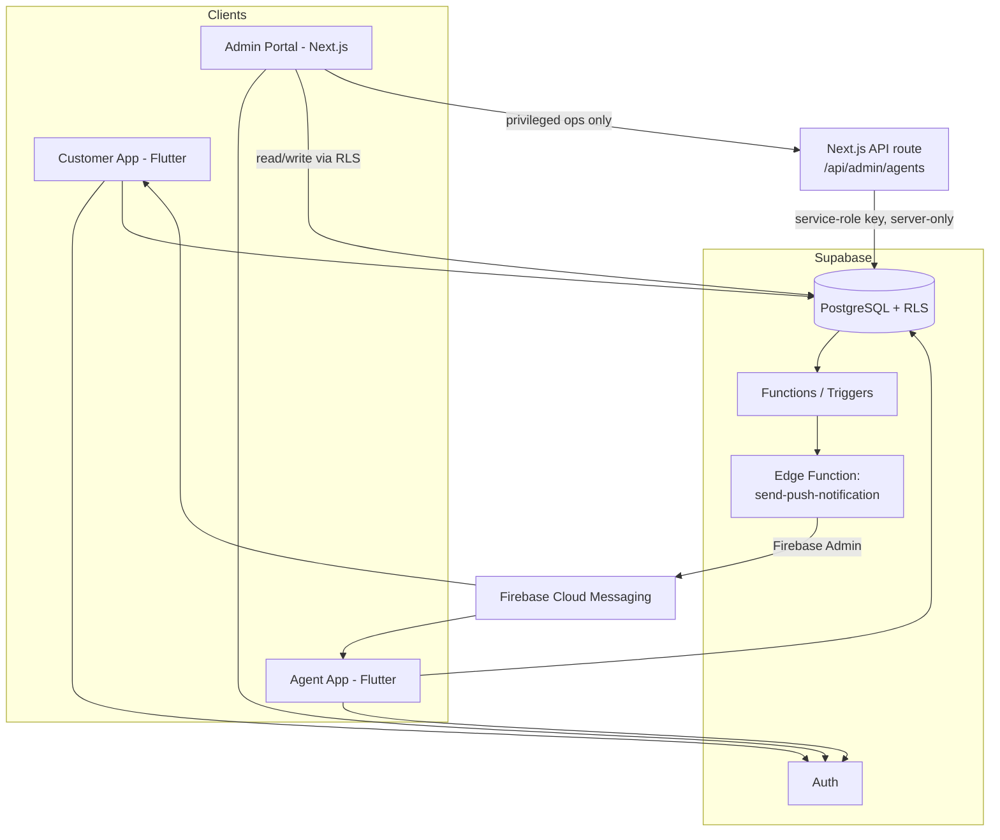
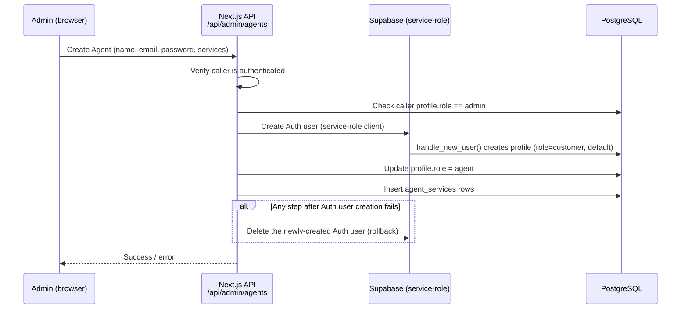
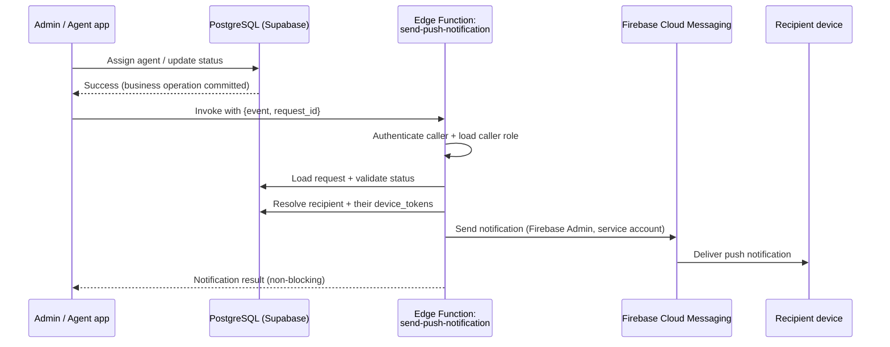
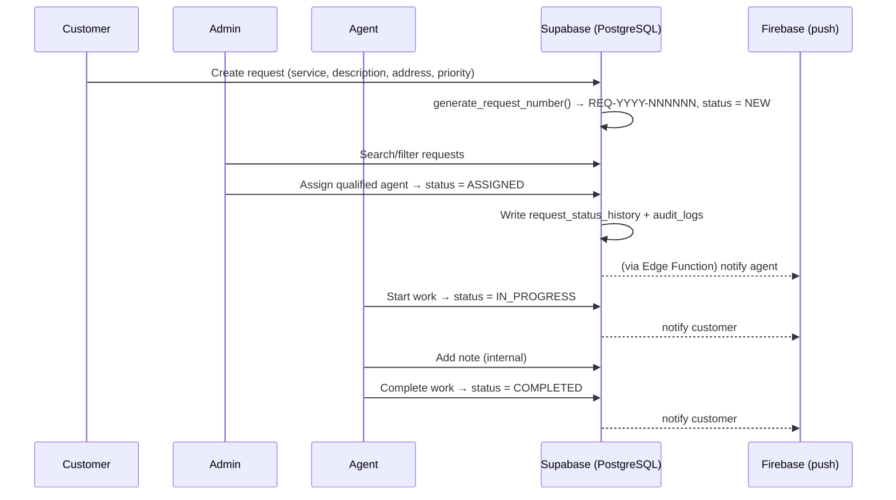

# QuickServe — Architecture Documentation

This document covers how the three applications and the backend fit together: the overall
system design, the agent-provisioning flow, the push-notification pipeline, and the end-to-end
request journey. For table-level detail see [`DATABASE.md`](DATABASE.md); for authorization
detail see [`SECURITY.md`](SECURITY.md).

---

## 1. Component Overview

| Component | Technology | Responsibility |
|---|---|---|
| Customer App | Flutter | Create/track service requests |
| Agent App | Flutter | Work assigned requests to completion |
| Admin Portal | Next.js, deployed on Vercel | Operational management, agent provisioning, oversight |
| Supabase | PostgreSQL, Auth, RLS, Functions/Triggers, Edge Functions | The entire backend — no separate application server |
| Firebase Cloud Messaging | Firebase | Push notification delivery only |

There is deliberately **no standalone backend framework** (no Spring Boot, no Express server)
behind QuickServe. Supabase's auto-generated REST layer, combined with PostgreSQL functions and
triggers, *is* the backend. The one place a small amount of trusted server-side code exists is
the Next.js API routes that need the Supabase **service-role** key (agent creation) — everything
else talks to Supabase directly from the client, protected by RLS.



---

## 2. Mobile App Architecture (Flutter)

Both the Customer and Agent experiences live in the same Flutter codebase, using a **feature-first**
folder structure so each business capability (auth, requests, services, profile, agent) evolves
independently:

```
mobile/lib/
├── core/
│   ├── config/        # SupabaseConfig (dart-define based)
│   ├── router/         # GoRouter route table + role-based redirects
│   ├── theme/
│   └── utils/
└── features/
    ├── auth/
    │   ├── data/         # AuthService, AuthController, ProfileService
    │   └── presentation/ # Login, Registration, ForgotPassword, Splash, Profile
    ├── services/
    │   ├── data/          # ServicesRepository
    │   └── presentation/  # ServicesScreen
    ├── requests/
    │   ├── data/          # RequestsRepository
    │   └── presentation/  # CreateRequest, MyRequests, RequestDetails
    └── agent/
        ├── data/           # AgentRepository, RequestNoteModel
        └── presentation/   # AgentHomeScreen, AgentRequestsScreen, AgentRequestDetailsScreen
```

Repositories isolate all Supabase queries from the widget layer. State management is Riverpod;
navigation is GoRouter, which also owns the **role-based redirect** logic — after login, it
reads `profiles.role` and routes a customer to the customer home and an agent to the agent home.

**Session handling:** Supabase's client SDK handles token refresh; the app doesn't implement its
own manual token storage. On launch, the splash screen checks for an existing session and routes
accordingly.

**Configuration:** the Supabase URL and publishable (anon) key are supplied at build/run time via
`--dart-define`, not hard-coded — keeping them out of source control while still being safe for
client-side use (RLS is what actually protects the data, not secrecy of this key).

---

## 3. Admin Web Architecture (Next.js)

```
web/app/
├── login/
├── dashboard/
├── requests/
├── customers/
├── agents/
├── services/
├── audit-logs/
└── api/
    └── admin/
        └── agents/route.ts     # the one privileged, server-only operation
```

The admin login flow authenticates through Supabase Auth exactly like the mobile apps, then
checks `profiles.role === 'admin'` before rendering any protected route. If a non-admin session
hits an admin API route directly, it receives a real `403`, not just a client-side redirect —
authorization for the web app is enforced the same way as the mobile apps: at the data/API
layer, not just by hiding a nav link.

The Supabase **service-role key never reaches the browser**. It is used exclusively inside the
one Next.js API route that needs elevated privileges — creating agent accounts.

---

## 4. Agent Provisioning Flow

Agents (and admins) are never self-registered — only an existing admin can create an agent
account, and the flow runs entirely server-side:



This prevents a user from ever elevating their own role by manipulating the client, and the
rollback step avoids leaving a half-created agent account (an Auth user with no matching
`agent` profile) if a later step fails.

---

## 5. Push Notification Pipeline

Push notifications are a bonus feature layered on top of the core flow — Firebase Cloud
Messaging (FCM) delivers them, but the *decision* to send one is always made server-side, driven
by the actual database state, never by the client claiming an event happened.



### Notification events

| Event | Allowed caller | Recipient |
|---|---|---|
| `REQUEST_ASSIGNED` | Admin | The newly assigned agent |
| `REQUEST_IN_PROGRESS` | Admin or the assigned agent | The customer |
| `REQUEST_COMPLETED` | Admin or the assigned agent | The customer |

### Key design decision: notification failure never rolls back the business action

If FCM delivery fails after an admin successfully assigns a request, the request **stays**
`ASSIGNED` — it does not revert to `NEW`. Notification delivery is a secondary, best-effort
concern layered on top of a database state change that has already committed. The caller
receives a warning if the push failed, but the assignment itself stands.

### Firebase credential handling

- The Firebase **service account JSON** is never bundled in the Flutter app. It is stored as a
  **base64-encoded Supabase secret** (`FIREBASE_SERVICE_ACCOUNT_B64`) and decoded at runtime
  inside the Edge Function — this was the fix for an earlier ASN.1 DER private-key parsing
  error encountered when the credential was handled differently.
- The Flutter app only ever holds the public Firebase **client** configuration
  (`firebase_options.dart`, generated by FlutterFire) — a fundamentally different, non-sensitive
  category of credential from the service-account JSON. (GitHub's secret scanner flags the
  client config's API key by default; it is not the sensitive credential.)
- Firebase project: `quickserve-194d8`. Android package ID `com.example.mobile` was deliberately
  left unchanged when the visible app name was rebranded to "QuickServe" — changing the package
  ID would have broken the existing Firebase registration for no benefit.

---

## 6. End-to-End Request Journey



At every arrow into the database, PostgreSQL — via RLS and the validation functions described in
[`DATABASE.md`](DATABASE.md) — is the layer actually deciding whether the write is allowed, not
the UI that initiated it.

---

## 7. Deployment Topology

| Component | Hosted on |
|---|---|
| Admin Portal (Next.js) | Vercel |
| Supabase backend (Postgres, Auth, RLS) | Supabase |
| Edge Function (`send-push-notification`) | Supabase |
| Customer & Agent apps | Distributed as an Android release APK |

Build verification performed before release: `flutter analyze` (no issues), `flutter build apk
--release` (~54 MB release APK), and a manual install/QA pass covering login, both mobile
journeys, push delivery, and confirming no leftover development/test UI shipped in the release
build.
