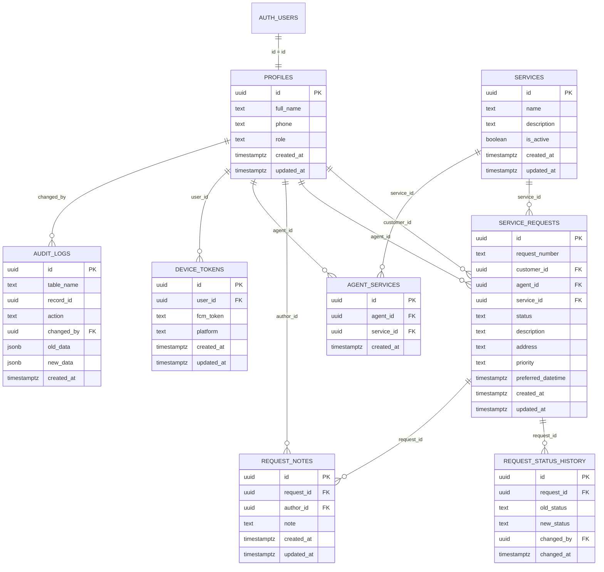
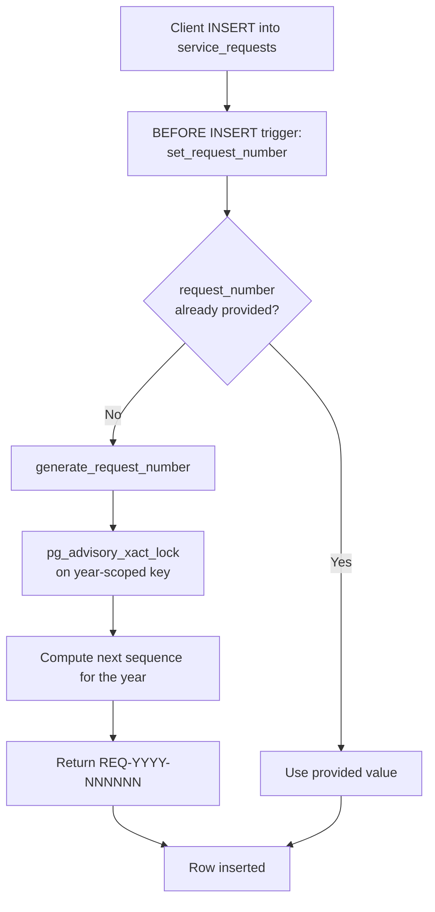
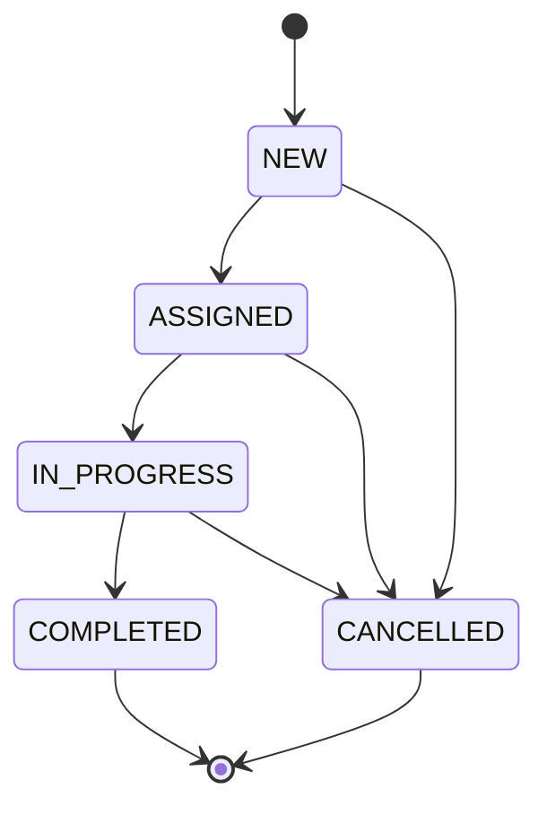

# QuickServe — Database Documentation

This document is the single source of truth for QuickServe's data model: schema, relationships,
indexes, functions/triggers, and the request-numbering scheme. For *who is allowed to do what*,
see [`SECURITY.md`](SECURITY.md) — this document focuses on structure and behavior.

**Platform:** Supabase (PostgreSQL) · **Authorization mechanism:** Row Level Security (documented
separately in `SECURITY.md`) · **Total application tables:** 8

---

## Table of Contents

1. [Entity-Relationship Diagram](#entity-relationship-diagram)
2. [Table Reference](#table-reference)
3. [Relationships & Delete Behavior](#relationships--delete-behavior)
4. [Indexes](#indexes)
5. [Request Number Generation](#request-number-generation)
6. [Request Status State Machine](#request-status-state-machine)
7. [Functions & Triggers Reference](#functions--triggers-reference)
8. [Status History vs. Audit Logs](#status-history-vs-audit-logs)
9. [Design Decisions Worth Explaining](#design-decisions-worth-explaining)

---

## Entity-Relationship Diagram



---

## Table Reference

### `profiles`

Application-level identity, extending Supabase's built-in `auth.users`.

| Column | Type | Notes |
|---|---|---|
| `id` | `uuid` | PK; equals `auth.users.id` |
| `full_name` | `text` | Display name |
| `phone` | `text` | Contact number |
| `role` | `text` | `customer` \| `agent` \| `admin` |
| `created_at` | `timestamptz` | |
| `updated_at` | `timestamptz` | |

Created automatically by the `handle_new_user()` trigger immediately after a new `auth.users`
row is inserted, always with `role = 'customer'` — self-registration can never grant `agent` or
`admin`. Those roles are only ever set by an admin, server-side (see
[`ARCHITECTURE.md`](ARCHITECTURE.md#agent-provisioning-flow)).

---

### `services`

The service catalog (seeded with **AC, Plumbing, Electrical, Cleaning**).

| Column | Type | Notes |
|---|---|---|
| `id` | `uuid` | PK |
| `name` | `text` | e.g. "AC Repair" |
| `description` | `text` | |
| `is_active` | `boolean` | Customers only ever see active services |
| `created_at` / `updated_at` | `timestamptz` | |

Deletion is intentionally **not implemented** — a service can be referenced by historical
requests, so it is deactivated (`is_active = false`), never removed.

---

### `service_requests`

The central business table.

| Column | Type | Notes |
|---|---|---|
| `id` | `uuid` | PK, internal identity |
| `request_number` | `text`, unique | Human-facing ID, `REQ-YYYY-NNNNNN` |
| `customer_id` | `uuid` FK → `profiles.id` | Owner of the request |
| `agent_id` | `uuid` FK → `profiles.id`, nullable | Null until assigned |
| `service_id` | `uuid` FK → `services.id` | Requested service |
| `status` | `text` | `NEW` \| `ASSIGNED` \| `IN_PROGRESS` \| `COMPLETED` \| `CANCELLED` |
| `description` | `text` | Customer's free-text description |
| `address` | `text` | |
| `priority` | `text` | `LOW` \| `MEDIUM` \| `HIGH` |
| `preferred_datetime` | `timestamptz` | Stored in UTC (converted client-side before insert) |
| `created_at` / `updated_at` | `timestamptz` | |

`preferred_datetime` is converted to UTC on the client (`DateTime.toUtc().toIso8601String()`)
before insert, so the stored instant is unambiguous regardless of the device's local time zone.

---

### `request_status_history`

Append-only ledger of every status transition — the *how did it get here*, distinct from the
current `status` column, which only answers *where is it now*.

| Column | Type | Notes |
|---|---|---|
| `id` | `uuid` | PK |
| `request_id` | `uuid` FK → `service_requests.id` | |
| `old_status` | `text` | |
| `new_status` | `text` | |
| `changed_by` | `uuid` FK → `profiles.id` | Who triggered the change |
| `changed_at` | `timestamptz` | |

Rows are written exclusively by a database trigger — never by a direct client insert — so the
history is tamper-proof.

---

### `audit_logs`

Broader system-level audit trail, covering changes to `profiles`, `services`,
`service_requests`, `request_notes`, and `agent_services`.

| Column | Type | Notes |
|---|---|---|
| `id` | `uuid` | PK |
| `table_name` | `text` | Which table changed |
| `record_id` | `uuid` | Which row changed |
| `action` | `text` | e.g. `INSERT` / `UPDATE` |
| `changed_by` | `uuid` FK → `profiles.id` | |
| `old_data` | `jsonb` | Previous row state |
| `new_data` | `jsonb` | New row state |
| `created_at` | `timestamptz` | |

Written by `create_audit_log()`, a `SECURITY DEFINER` function — see
[Functions & Triggers](#functions--triggers-reference).

---

### `request_notes`

Internal agent-facing notes on a request (UI-limited to ~500 characters, empty notes rejected).

| Column | Type | Notes |
|---|---|---|
| `id` | `uuid` | PK |
| `request_id` | `uuid` FK → `service_requests.id` | |
| `author_id` | `uuid` FK → `profiles.id` | The agent who wrote it |
| `note` | `text` | |
| `created_at` / `updated_at` | `timestamptz` | |

By product decision, notes are visible to the authoring agent only — not to the customer, and
not currently surfaced on the admin dashboard (see [`README.md`](../README.md#known-limitations)).

---

### `agent_services`

Many-to-many mapping of agents to the services they're qualified for.

| Column | Type | Notes |
|---|---|---|
| `id` | `uuid` | PK |
| `agent_id` | `uuid` FK → `profiles.id` | |
| `service_id` | `uuid` FK → `services.id` | |
| `created_at` | `timestamptz` | |

`UNIQUE (agent_id, service_id)`. A single agent can specialize in multiple services (e.g. AC +
Electrical), and a service can have multiple qualified agents. `validate_agent_service_mapping()`
rejects any attempt to map a non-agent profile into this table.

> **Why many-to-many instead of a single `profiles.service_id` column?** Real agents specialize
> in more than one service, and a single foreign key on `profiles` can't express that. This is
> called out in the project notes as a decision that should **not** be reverted.

---

### `device_tokens`

FCM registration tokens for push delivery.

| Column | Type | Notes |
|---|---|---|
| `id` | `uuid` | PK |
| `user_id` | `uuid` FK → `profiles.id` | |
| `fcm_token` | `text` | |
| `platform` | `text` | e.g. `android` |
| `created_at` / `updated_at` | `timestamptz` | |

`UNIQUE (user_id, fcm_token)` — prevents duplicate rows for the same user/token pair. It does
**not** currently prevent the same physical token from being associated with more than one user
(observed during testing when the same device logged in as different accounts); tracked as a
known limitation, not a blocker.

---

## Relationships & Delete Behavior

| Foreign key | Points to | On delete |
|---|---|---|
| `profiles.id` | `auth.users.id` | — |
| `service_requests.customer_id` | `profiles.id` | `RESTRICT` |
| `service_requests.agent_id` | `profiles.id` | `SET NULL` |
| `service_requests.service_id` | `services.id` | `RESTRICT` |
| `request_status_history.request_id` | `service_requests.id` | — |
| `request_notes.request_id` | `service_requests.id` | — |
| `request_notes.author_id` | `profiles.id` | — |
| `agent_services.agent_id` | `profiles.id` | — |
| `agent_services.service_id` | `services.id` | — |
| `device_tokens.user_id` | `profiles.id` | — |

`RESTRICT` on `customer_id` and `service_id` protects request history from silently disappearing
if a profile or service were ever removed. `SET NULL` on `agent_id` allows an agent's account to
be removed later without deleting the requests they worked — the request simply reverts to
unassigned-agent state while keeping its own history intact.

---

## Indexes

| Index | Reason |
|---|---|
| `service_requests(customer_id)` | Powers "show this customer's requests" |
| `service_requests(agent_id)` | Powers "show this agent's assigned work" |
| `service_requests(status)` | Powers status-filtered dashboard/admin queries |

Indexes are added deliberately, only on the columns that back real, recurring query patterns —
every index adds storage and write overhead, so common access paths are indexed rather than every
column.

---

## Request Number Generation

Every request gets a human-readable business identifier in addition to its UUID:

```
REQ-2026-000010
```



**Why it lives in PostgreSQL, not the client:** a human-facing sequential identifier is a
business rule, not a UI concern — centralizing it in one trusted place means every request
number is globally unique and consistently formatted, regardless of which app created the row.

**The bug this fixed:** the original generator computed `MAX(existing suffix) + 1`. Because RLS
scopes a customer's visibility to their own rows, a customer's session could only see their own
requests when computing that MAX — so two different customers, in the same year, could both
calculate the same "next" number and collide on the `UNIQUE` constraint.

**The fix:**
1. `generate_request_number()` was made `SECURITY DEFINER` (with a controlled `search_path`), so
   it computes the next number against the *full* table regardless of the caller's RLS
   visibility.
2. A transaction-scoped advisory lock — `pg_advisory_xact_lock(hashtext('quickserve_request_number_' || current_year)::bigint)`
   — serializes concurrent request-creation transactions so two simultaneous inserts in the same
   year can never compute the same next value.

This is the strongest interview story in the project: it touches a `UNIQUE` constraint failure,
RLS visibility, `SECURITY DEFINER`, `search_path` safety, and transaction concurrency all in one
bug.

---

## Request Status State Machine



Valid statuses: `NEW`, `ASSIGNED`, `IN_PROGRESS`, `COMPLETED`, `CANCELLED`. The earlier project
plans referenced `CREATED`/`ACCEPTED`, but the shipped schema deliberately uses `NEW` and skips a
separate `ACCEPTED` state — **this naming is considered final** and should not be changed
without a real business-requirements change.

`validate_request_status_transition()` enforces the diagram above inside the database: an
attempt to jump straight from `NEW` to `COMPLETED`, for example, is rejected regardless of which
client (or which role) issued the update.

---

## Functions & Triggers Reference

| Function | Type | Purpose |
|---|---|---|
| `handle_new_user()` | `AFTER INSERT` trigger on `auth.users` | Creates the matching `profiles` row with `role = 'customer'` |
| `generate_request_number()` | `SECURITY DEFINER` | Computes the next `REQ-YYYY-NNNNNN`, using an advisory lock to avoid collisions |
| `set_request_number()` | `BEFORE INSERT` trigger on `service_requests` | Calls `generate_request_number()` when the client didn't supply one |
| `validate_request_status_transition()` | Trigger / constraint function | Enforces the state machine above on every status update |
| `validate_agent_request_update()` | Trigger / constraint function | Blocks an agent from modifying `customer_id`, `agent_id`, `service_id`, `request_number`, or `created_at` on a request they're updating |
| `validate_agent_service_mapping()` | Trigger / constraint function | Rejects mapping a non-agent profile into `agent_services` |
| `create_audit_log()` | `SECURITY DEFINER`, `SET search_path = public` | Writes a row to `audit_logs` for tracked table changes |
| Status-history trigger | `AFTER UPDATE` on `service_requests` | Writes the old→new transition into `request_status_history` |

`SECURITY DEFINER` functions run with elevated privileges, so each one is written narrowly and
pins its `search_path` explicitly — this avoids the classic search-path-hijacking risk that comes
with elevated-privilege functions.

---

## Status History vs. Audit Logs

These two tables intentionally answer different questions:

| | `request_status_history` | `audit_logs` |
|---|---|---|
| Question answered | *How did this request's status change over time?* | *What changed on any tracked record, and what were the old/new values?* |
| Scope | `service_requests` lifecycle only | `profiles`, `services`, `service_requests`, `request_notes`, `agent_services` |
| Written by | Status-change trigger | `create_audit_log()` |
| Client-writable? | No — insert-only via trigger | No — insert-only via `SECURITY DEFINER` function |

---

## Design Decisions Worth Explaining

A short list of "why," pulled together for interview prep — the full reasoning behind each is in
[`SECURITY.md`](SECURITY.md) and [`ARCHITECTURE.md`](ARCHITECTURE.md):

- **UUID + `request_number` together:** UUID is the trusted internal identity; `request_number`
  is the human-facing one. Neither replaces the other.
- **`agent_services` as a join table, not a column on `profiles`:** agents specialize in more
  than one service.
- **No hard delete on `services`:** deleting would orphan historical requests; deactivation
  preserves history while hiding the service from new requests.
- **`SET NULL` on `service_requests.agent_id`, `RESTRICT` on `customer_id`/`service_id`:** an
  unassigned request is a valid, expected state; an orphaned customer or service reference is
  not.
