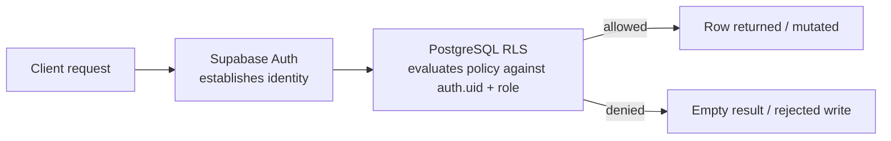

# QuickServe — Security Documentation

The single most important principle in QuickServe: **the client is not the security boundary.**
Flutter and Next.js call Supabase, but PostgreSQL Row Level Security (RLS) — not a hidden button,
not a client-side `if` statement — decides which rows an authenticated identity can read or
write. This document is the plain-English policy reference plus what was actually tested.

---

## 1. Authentication vs. Authorization

| Concept | In QuickServe |
|---|---|
| **Authentication** — *who are you?* | Supabase Auth verifies credentials and issues a session/JWT |
| **Authorization** — *what can you do?* | PostgreSQL RLS policies, evaluated against `auth.uid()` and `profiles.role` |

A common misconception worth naming explicitly: **RLS does not authenticate anyone.** It's a
pure data-access/authorization mechanism that runs *after* Supabase Auth has already
established who the caller is.

---

## 2. Row Level Security — Policy Reference

RLS is enabled on **every** application table. Policy intent, in plain English:

| Table | Customer | Agent | Admin |
|---|---|---|---|
| `profiles` | View & update own row only | View & update own row only | Full manage (`ALL`) |
| `services` | View active services only | View active services only | Full manage |
| `service_requests` | `INSERT`/`SELECT` where `customer_id = auth.uid()` | `SELECT`/`UPDATE` where `agent_id = auth.uid()` | Unrestricted, via an `is_admin()` check on `profiles.role` |
| `request_status_history` | View rows for own requests | View rows for assigned requests | View all |
| `audit_logs` | No access | No access | View all |
| `agent_services` | No access | View own mappings | Full manage |
| `device_tokens` | Own tokens only (`SELECT`/`INSERT`/`UPDATE`/`DELETE`) | Own tokens only | — |
| `request_notes` | No access | Own authored notes on assigned requests | — (not currently surfaced in admin) |

Two tables are **insert-only via trigger** for every role, including admins acting through the
client SDK: `request_status_history` and `audit_logs`. No client — regardless of role — writes
to these directly; they are populated exclusively by `SECURITY DEFINER` trigger functions, which
is what makes them a trustworthy audit trail rather than something a client could fabricate.

**Ownership filters happen twice, on purpose.** The Flutter app filters "My Requests" by
`customer_id = current user` for query efficiency and UX — but that client-side filter is not
what's actually protecting the data. RLS independently re-enforces the same rule at the database
layer, so even if the client-side filter were removed or bypassed, the underlying query would
still only ever return that customer's own rows.

---

## 3. Database-Enforced Business Rules (Beyond Row Visibility)

RLS controls *which rows* a role can touch. A separate layer of `SECURITY DEFINER` functions and
triggers controls *what values* are valid within an allowed write:

| Function | What it stops |
|---|---|
| `validate_request_status_transition()` | An update trying to skip states in the lifecycle (e.g. `NEW → COMPLETED` directly) |
| `validate_agent_request_update()` | An agent (who does have `UPDATE` rights on their assigned request) changing `customer_id`, `agent_id`, `service_id`, `request_number`, or `created_at` — i.e. reassigning a request to themselves or altering its identity |
| `validate_agent_service_mapping()` | Mapping a non-agent profile into `agent_services` |
| `handle_new_user()` | Self-registration ever setting `role` to anything other than `customer` |

This matters because RLS alone only answers *"can this role touch this row at all?"* — these
functions answer the finer-grained *"is this specific write, on a row they're otherwise allowed
to touch, actually a legitimate business operation?"*

---

## 4. Secrets Architecture

Three distinct categories of credential exist in the project, each scoped differently:

| Category | Examples | Where it lives | Client-safe? |
|---|---|---|---|
| Public client configuration | `SUPABASE_URL`, `SUPABASE_PUBLISHABLE_KEY` (mobile); `NEXT_PUBLIC_SUPABASE_URL`, `NEXT_PUBLIC_SUPABASE_PUBLISHABLE_KEY` (web) | Mobile `--dart-define`, web `.env.local` | **Yes** — safe for client use precisely because RLS is what actually protects data, not secrecy of this key |
| Server-only Supabase credential | `SUPABASE_SERVICE_ROLE_KEY` | Next.js server environment only (used by `/api/admin/agents`) | **No — never in Flutter or the browser bundle.** This key bypasses RLS entirely |
| Firebase service account | `FIREBASE_SERVICE_ACCOUNT_B64` | Supabase secret, decoded at runtime inside the Edge Function | **No — never shipped in the Flutter app** |

The Flutter app does hold a Firebase **client** configuration file
(`firebase_options.dart`, generated by FlutterFire) — this is a fundamentally different,
non-sensitive category (it's meant to be embedded in client apps) from the Firebase
**service-account** JSON, which grants server-side send privileges and is kept out of the
repository and out of the mobile bundle entirely.

**Rule of thumb applied throughout the project:** if a credential can bypass RLS or send
privileged operations on the platform's behalf, it never leaves trusted server infrastructure
(Next.js API routes, Supabase Edge Functions). Anything that reaches a mobile app or a browser
bundle is, by design, safe to expose — because RLS, not secrecy, is the actual gate.

---

## 5. What Was Actually Tested

In the interest of an honest, interview-ready account rather than an inflated one:

**Verified:**
- Customer row-isolation was behaviorally tested: an authenticated "Customer One" session
  queried `service_requests` through the REST interface and received only their own request —
  "Customer Two"'s request was not returned.
- RLS is confirmed enabled on all application tables, with the intended policies and
  `SECURITY DEFINER` functions in place.
- Admin access, agent request isolation, agent request-field protection, status-transition
  enforcement, and agent-service mapping validation were each verified during development.
- The admin portal was manually tested end-to-end to confirm agent/customer credentials cannot
  reach admin-only routes (real `403`, not just a hidden nav item).

**The one test explicitly called out as non-negotiable by the assignment brief:** an automated
check that Customer A cannot read Customer B's request via the API using two different customer
JWTs. This is the cheapest, highest-signal differentiator named directly in the brief and should
not be skipped.

**Not yet exhaustively covered:**
- A second, independent customer account beyond the "Customer One vs. Customer Two" isolation
  check was not separately stress-tested.
- Full automated (rather than manual, role-impersonated) RLS regression tests are a roadmap item
  — see [`README.md`](../README.md#roadmap).

---

## 6. Interview-Ready Talking Points

- *"Why not just check the user's role in the Flutter/React code?"* — A client can be modified
  or bypassed entirely; anyone can decompile an APK or open dev tools. Authorization has to be
  enforced somewhere the client can't reach, which is why every rule that matters — row
  visibility, status transitions, field protection — lives in PostgreSQL, not the UI.
- *"What's the actual difference between `request_status_history` and `audit_logs`?"* — one is
  narrowly about a request's lifecycle; the other is a general-purpose record of changes across
  several tables. Different questions, different tables, on purpose.
- *"What's the biggest risk if RLS were accidentally disabled on a table?"* — an authenticated
  client credential alone is not authorization. Without RLS, any authenticated user could
  potentially read or modify rows belonging to other users, since the network-level credential
  no longer implies anything about which rows they should see.
